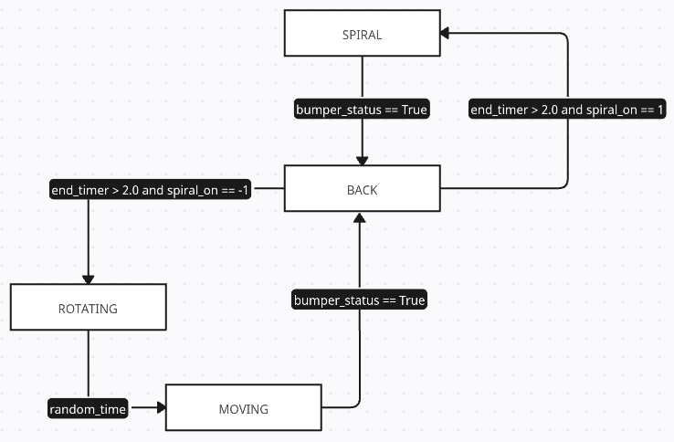
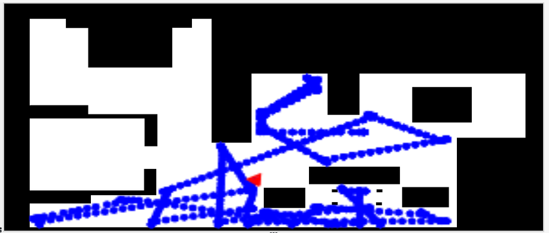
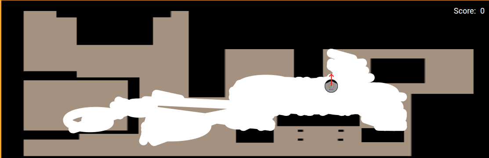
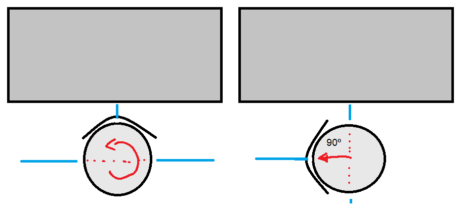

# P1 Vacuum_Cleaner

## Introducción

El objetivo de la siguiente práctica es la implementación de un algoritmo que consiga el mayor rendimiento posible para una aspiradora robótica sin localización. Solo dispondremos del sensor bumper (sensor de choque) y un laser 180º en la parte frontal.

## Algoritmo bumper aleatorio con espiral

Las primeras pruebas que realice fueron para conocer el funcionamiento del bumper y concretar que tan sensible era. Los resultados no fueron los esperados:

- Los bumpers laterales izquierdo y derecho tienen un área de choque pequeña en comparación con la central. Esto es un problema a la hora de detectar qué zona ha golpeado realmente.

- El sensor devuelve el valor equivalente a la parte central aunque no esté siendo golpeada. Si no se tiene en cuenta, el funcionamiento del algoritmo podría no ser el esperado. 

Con los resultados anteriores, cree el siguiente esquema de ejecución.

La primera aproximación solo tenía tres estados: MOVING, BACK, ROTATING. En esta implementación los movimientos de rotación se hacen por tiempos aleatorios y el movimiento de retroceso es corto, suficiente para salir de la zona del bumper.

Con estos estados, se consiguió el siguiente resultado:

Como se puede apreciar, el area aspirada no es muy grande. Si es verdad que se alcanzan muchas zonas, pero no limpia grandes superficies.

Con el nuevo estado SPIRAL, se consigue mejorar la limpieza dejando la aleatoriedad de los estados anteriores.

Ahora el resultado es el de una limpieza mucho mas estendida y no lineal.

## Video del funcionamiento

Nuevo estado SPIRAL: [^1]

[^1]: https://urjc-my.sharepoint.com/:v:/g/personal/e_martint_2022_alumnos_urjc_es/EaF5MflgH2BCr1bVUaE2oFQBy4ofQoaXI8BAkhqc8mOjuA?nav=eyJyZWZlcnJhbEluZm8iOnsicmVmZXJyYWxBcHAiOiJPbmVEcml2ZUZvckJ1c2luZXNzIiwicmVmZXJyYWxBcHBQbGF0Zm9ybSI6IldlYiIsInJlZmVycmFsTW9kZSI6InZpZXciLCJyZWZlcnJhbFZpZXciOiJNeUZpbGVzTGlua0NvcHkifX0&e=5cBNJ0

## Conclusión 

Las aspiradoras sin localización siguen siendo útiles en las tareas de limpieza, solo es necesarió tener algoritmos que eviten los atascos y que ayuden a limpiar grandes superficies. 

Si es verdad, que conocer la posición del robot hubiera dado otro tipo de enfoque al problema y otras posibles implementaciones. Aun así, tras haber investigado las posibles soluciones, el esquema actual deja un mejor resultado que el primero.

## Algoritmo laser experimental 

Esta rama de investigación fue llevada acabo con el fin de conseguir un giro "perfecto" con un ángulo determinado.

### Primeras experiencias y resultados

Las primeras pruebas realizadas consistieron en determinar qué datos eran los trasmitidos por el láser y cómo manejarlos. Los resultados dieron como resultado el siguiente problema:

- Las medidas recogidas por el laser son imprecisas y muy cambiantes. No es un problema grave, pero dificulta la obtención de un giro.

Tras conocer las limitaciones del láser, me planteé la posibilidad de determinar el ángulo de giro tomando como referencia el láser emitido en la parte lateral del robot. La idea fue la siguiente:

_Cuando el robot choca de manera frontal y se inicia el giro en sentido horario o antihorario, se toma una primera instantánea de la distancia en el lado externo de la circunferencia. A medida que el robot gira, la distancia recogida por el laser irá reduciéndose hasta que se tomen datos perpendiculares a la pared, estos equivaldrían a dar un giro de 90º_

Los resultados no fueron los esperados. Los laseres pueden dar una idea de como de despejada se encuentra una zona, pero no son lo suficientemente precisos como para poder calcular un ángulo de giro.

