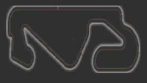

# P2 Follow line

## Introducción

La siguiente práctica consiste en implementar un controlador PID reactivo, que permita recorrer un circuito de carreras, tomando como referencia una linea roja en el centro de la pista.

Para poder detectar la linea con claridad, el primer paso es tratar la imagen del coche con un filtro de color. Después se debe determinar cual es el error de desplazamiento que exite entre el coche y la linea central del circuito. Por último, pasaremos el error al controlador PID y tras ajustar los valores, obtendremos la velocidad angular necesaria para enderezar la trazada.

## Filtro de color

En este apartado, nos podemos plantear dos posibles soluciones:

- Realizar un filtrado del color rojo usando solo los valores RGB de la imagen en crudo.
- Transformar la imagen a HSV y filtrar el color rojo en este modelo.

Para implementar el filtro, he preferido emplear un filtro de color HSV[^1]. Con él, puedo aislar de manera más precisa el color rojo de la carretera y conseguir una imagen limpia. 

<div align="center">
<p style = 'text-align:center;'> </p>
</div>

Los valores para el color rojo se encontraban entre: 

  - Filtro bajo -> **H:120 S:100 V:100**
  - Filtro alto -> **H:150 S:255 V:255**

Lo primero que hay que tener en cuenta, es que [OpenCV](https://es.wikipedia.org/wiki/OpenCV) permite trabajar con matrices 3D/imagenes de una forma sencilla. Esto nos permite usar funciones de transformación, rotación, traslación... sobre la imagen y para poder trabajar con filtros como en nuestro caso.

Para la práctica solo necesité hacer los siguientes pasos:

1) Crear una copia de la imagen original en HSV. Usando la función [**cv2.cvtColor**](https://docs.opencv.org/3.4/d8/d01/group__imgproc__color__conversions.html#ga397ae87e1288a81d2363b61574eb8cab) podemos transformar una imagen RGB a HSV.

2) Crear una mascara con los valores de rojo deseados. Usando la función [**cv2.inRange**](https://docs.opencv.org/3.4/d2/de8/group__core__array.html#ga48af0ab51e36436c5d04340e036ce981) y pasando como parametros el rango de color a filtrar, conseguimos localizar en que pixeles se encuentra el color y marcarlos como "activos" (poner a 1).

3) Pasar la mascara sobre la imagen original, para "apagar" (poner a 0) aquellos pixeles que no sean rojos. Uso la función [**cv2.bitwise_and**](https://docs.opencv.org/3.4/d2/de8/group__core__array.html#ga60b4d04b251ba5eb1392c34425497e14).

El resultado del filtro es el siguiente:

<div align="center">
<p style = 'text-align:center;'> </p>
</div>

[^1]: https://es.wikipedia.org/wiki/Modelo_de_color_HSV.

## Calculo del error

Para estos cálculos, tome como referencia la imagen y el número de pixeles que la componen. Estas medidas las empleé para mover mi línea de cálculo sobre 15 pixeles por debajo de la mitad de la imagen. Con esta línea comprobé cuantos pixeles había entre el centro y el primer pixel de color rojo a cada lado del coche. Finalmente, invierto el valor del dato para que coincida con el sentido de giro que se realizará más adelante. 

**Formula empleada**
```
img[center_line + 15][center_point + i][2] > 0
```
El último campo pertenece al color en la imagen, y los dos anteriores a los pixeles en altura y anchura respectivamente.

El índice **i** del _bucle for_ es el valor que empleo como error desde el centro de la imagen.

## PID

Este es el apartado más importante de la práctica, ya que en él se realizan los calculos necesarios para estimar un valor de giro que corrija el error con respecto a la linea roja.

Su implementación matemática pura es complicada, principalmente por tener que ralizar calculos integrales y derivativos sobre el error y su acumulación.

Los cálculos que se deben realizar para el PID son los siguentes[^2]:


En nuestro caso simplificaremos los calculos realizando operaciones simples. Ya que como era de esperar, no se pueden realizar estos cálculos sin librerías matemáticas de alto nivel.

Metodo empleado:

``` python
P = Kp*error
integral = integral + Ki*error
D = Kd*(error-error_prev)

W = P + integral + D
```

Los parametros **_KD, KI y KP_**, son regulables y afecta directamente sobre el peso de cada una de las partes del PID.

- **KD**: Afecta a la parte Derivativa del controlador.
- **kI**: Hace que el error acumulado en la parte integral sea regulado.
- **KP**: Se encarga de dar peso a la parte Proporcional del error.

_Los valores KP KI KD se modifican dependiendo del modelo de coche empleado_

De esta manera conseguimos el control del error en pixeles; aún queda convertirlo a velocidad angular.

[^2]: https://es.wikipedia.org/wiki/Controlador_PID.

## Escalado de velocidades

Como el error está basado en distancia entre pixeles, la velocidad de giro tendrá que estar acotada entre unos valores máximos y mínimos, que permitan que el coche gire sin brusquedad.

La fórmula empleada coge como valor **máximo original** la mitad del ancho de la pantalla hacia la derecha y el **mínimo** hacia la izquierda. Los valores de velocidad varían en función del modelo empleado.
```
scaled_data = (MIN_VEL_W + ((vel - min_original) / (max_original - min_original)) * (MAX_VEL_W - MIN_VEL_W))
```
## Modelo Simple

Modelo en el que las velocidades angulares afectan al eje central del coche, haciendo que gire sobre si mismo.
La velocidad lineal del coche es absoluta y no guarda inercia cuando se decelera el coche.

### Primeras experiencias y resultados

Las primeras pruebas no fueron sencillas. Seguí las indicaciones **Trial and Error** de la documentación del ejercicio con los siguientes resultados:

  - El circuito se podía completar tan solo empleando el controlador *Proporcional*, pero con muchas oscilaciones.
  - Cuando se añadía la parte *Integral* el sistema no era capaz de soportar valores por encima del 0.01 debido a que el error está basado en pixeles.
  - La parte _Derivativa_ mejoró la respuesta y suavizó la salida del controlador.

Exite un apartado en el código, que pertenece al algoritmo de recuperación. En caso de no poder determinar un error, porque la linea no es visible o el coche está en otra orientación, el vehículo girará sobre si mismo dependiendo del valor del error previó. Este giro hará que se vuelva a detectar la linea y se recupere el funcionamiento normal de la trazada.

En el video [^3] se puede ver como se realiza la maniobra de recuperación. 

### Video del funcionamiento

Circuito Simple: [^4]

<div align="center">
<p style = 'text-align:center;'> </p>
</div>

Circuito Montmelo: [^5]

<div align="center">
<p style = 'text-align:center;'> </p>
</div>

[^3]: https://urjc-my.sharepoint.com/:v:/g/personal/e_martint_2022_alumnos_urjc_es/EfPgY_olyMZPk0Nth9iT98ABxpffkRWyNlB3yKmrRzr9vQ?nav=eyJyZWZlcnJhbEluZm8iOnsicmVmZXJyYWxBcHAiOiJPbmVEcml2ZUZvckJ1c2luZXNzIiwicmVmZXJyYWxBcHBQbGF0Zm9ybSI6IldlYiIsInJlZmVycmFsTW9kZSI6InZpZXciLCJyZWZlcnJhbFZpZXciOiJNeUZpbGVzTGlua0NvcHkifX0&e=Ka80jX

[^4]: https://urjc-my.sharepoint.com/:v:/g/personal/e_martint_2022_alumnos_urjc_es/ERXixTO5A0tOkooiltLk3SIBepq3p_gaGAndnzq_GQf89g?nav=eyJyZWZlcnJhbEluZm8iOnsicmVmZXJyYWxBcHAiOiJPbmVEcml2ZUZvckJ1c2luZXNzIiwicmVmZXJyYWxBcHBQbGF0Zm9ybSI6IldlYiIsInJlZmVycmFsTW9kZSI6InZpZXciLCJyZWZlcnJhbFZpZXciOiJNeUZpbGVzTGlua0NvcHkifX0&e=1jnbAc

[^5]: https://urjc-my.sharepoint.com/:v:/g/personal/e_martint_2022_alumnos_urjc_es/ETNNZ-FChfhGtvHrMiBZEtMBLW9XM2VrvXz2qK2t-WWQYw?nav=eyJyZWZlcnJhbEluZm8iOnsicmVmZXJyYWxBcHAiOiJPbmVEcml2ZUZvckJ1c2luZXNzIiwicmVmZXJyYWxBcHBQbGF0Zm9ybSI6IldlYiIsInJlZmVycmFsTW9kZSI6InZpZXciLCJyZWZlcnJhbFZpZXciOiJNeUZpbGVzTGlua0NvcHkifX0&e=HOYFDI


## Modelo Simple Ackerman 

Modelo en el que las velocidades angulares afectan al eje delantero del coche, haciendo que gire únicamente la parte delantera de este, dejando las ruedas traseras rígidas al movimiento. Si el coche dispone de suficiente velocidad lineal, este se moverá en función del ángulo de las ruedas delanteras.
La velocidad lineal del coche es relativa y guarda inercia. 

**IMPORTANTE:** *Para activar el modelo Ackerman, hay que cambiar la variable global **ACKERMAN_ON** por True; por defecto se encuentra en False.*

### Primeras experiencias y resultados

El modelo es complicado de manejar. La primera parte a tener en cuenta es la facilidad con la que las ruedas traseras derrapan y pierden el control. Si tenemos en cuenta esto, el control al error tiene que ser muy ligero.

Durante la prueba del circuito simple, he podido comprobar que el coche no puede soportar velocidades altas. Cuando se pone una velocidad de 50, el coche puede volcar sin apenas actuación del controlador.

En el resto de circuitos, hay tramos en los que el coche pierde velocidad sin ser cambiado en el código.

Por lo demás, el sistema de recuperación facilita que en ciertos tramos el coche pueda volver a encontrar la línea cuando gira lentamente en curvas cerradas.

### Video del funcionamiento

Circuito Ackerman: [^6]

[^6]: https://urjc-my.sharepoint.com/:v:/g/personal/e_martint_2022_alumnos_urjc_es/EWCaRZe2HQdFmZvJOrIKgvIBtP8TpZV4KIcKO4b_zKROpQ?nav=eyJyZWZlcnJhbEluZm8iOnsicmVmZXJyYWxBcHAiOiJPbmVEcml2ZUZvckJ1c2luZXNzIiwicmVmZXJyYWxBcHBQbGF0Zm9ybSI6IldlYiIsInJlZmVycmFsTW9kZSI6InZpZXciLCJyZWZlcnJhbFZpZXciOiJNeUZpbGVzTGlua0NvcHkifX0&e=a2gVsY


## Conclusión

El controlador PID es un mecanismo de control efectivo, que a permitido un control reactivo sigue lineas muy rápido. No obstante, presenta dificultades a la hora de encontrar los valores óptimos de K. Estos valores además pueden no ser útiles en todos los circuitos.

El modelo Ackerman es más complejo, suponiendo un reto a la hora de calibrar los parametros K.