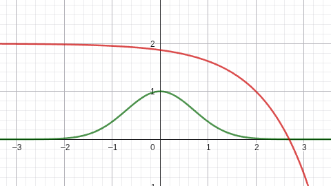

# P3 Obstacle-avoidance

## Introducción

Esta práctica consiste en atravesar un circuito esquivando obstáculos en el camino. El coche solo dispone de láser, sus coordenadas y la referencia del camino a seguir desglosado en objetivos.

Una aproximación a la solución, es basar el comportamiento en un modelo VFF , que tome los objetos detectados por el láser.


<div align="center">
<p style = 'text-align:center;'> </p>
</div>

## Modelo VFF

El modelo consiste en recrear una serie de fuerzas que actuan sobre el coche, teniendo en cuenta el entorno que le rodea y el objetivo al que queremos llegar.
Este modelo basa su comportamiento en un escenario local y cercano. Esto permite reactividad en su comportamiento frente a obstáculos.

Es necesario emplear un sistema de sensores para poder reconocer el medio, de esta forma podremos transformar estas detecciones/obstaculos, en fuerzas de repulsión sobre nuestro modelo. Además, es necesario tomar un objetivo con el cual fijar una fuerza de atracción que impulse al modelo hacia este.

<div align="center">
<p style = 'text-align:center;'> </p>
</div>

_Rojo: Vector repulsivo; Azul: Vector atractivo; Verde: vector_resultado_

### Vector atractivo

Para conseguir el vetor atractivo, se ha empleado una serie de objetivos desplegados por el circuito. Estos puntos están basados en coordenadas globales y tras pasarlos a coordenadas relativas al robot, conseguiremos el vector guía para generar el vector atractivo.

**Fórmula empleada**

Una vez tengo el objetivo, calculo el ángulo que hay entre la posición del coche y este, usando la arcotangente. Con esto conseguiremos tener una orientación.
Después calculo el módulo del vector, así tengo la dirección en la que el coche deberá moverse.
Por último, dependiendo del módulo, calculo los ejes del vector atractivo multiplicando el módulo por el seno o coseno dependiendo de que eje quiera obtener. Y en caso de tener un módulo muy alto, hago que no pueda subir su valor a más de 2.

### Vector repulsivo

Este es el vector que más cuesta extraer.
Para calcular este vector, necesitaremos los datos tomados por el láser. El laser devuelve un array de 180 posiciones, las cuales equivalen a los grados en los que hay un haz de laser y que contiene las distancias hasta el obstáculo encontrado.
Para trabajar mejor con los datos, se pasa de grados a radianes.
Como la distancia no deja de ser el módulo del vector, tengo que conseguir que sea inversamente proporcional para trasladarlo a mi vector repulsivo. Por ello empleo esta fórmula.

**Fórmula empleada**

- Fórmula antígua 
$$\left( 2 - e^{x-2}\right)$$

- Nueva Fórmula:
$$\left( e^{-x^2}\right)$$


<div align="center">
<p style = 'text-align:center;'> </p>
</div>


Esta imagen representa el resultado de aplicar la fórmula sobre el módulo del vector objetivo.

Más adelante se emplea la misma técnica que con el vector atractivo; el módulo es multiplicado por el coseno del ángulo para obtener X y el seno para obtener Y.
Por último, se hará una media de todas las coordenadas X e Y, por separado, para determinar cual es el vector repulsivo resultante y dominante.

### Vector resultado

Una vez calculados los vectores atractivo y repulsivo, sumaremos sus componentes X e Y por separado. No sin antes acentuar los valores, multiplicando los distintos vectores por las constantes ælpha y ßeta. Estas servirán para decidir qué fuerza influirá más en el resultado del vector.

Como hemos visto en imágenes anteriores, el vector resultado será el que determine en qué dirección ha de moverse el coche para esquivar el obstáculo y seguir el objetivo al mismo tiempo. 

## Movimiento del vehículo

Actualmente solo disponemos de un vector que indica que dirección tenemos que tomar y con que fuerza. Pero hay que traducir esta fuerza en velocidad lineal y la dirección en velocidad angular.

### Velocidad directamente proporcional al vector resultado y filtrado

*_Para la velocidad lineal y angular, se ha empleado la componente X e Y del vector resulatante respectivamente._**

Este modelo presenta problemas:

- La velocidad angular es muy cambiante y hace que los giros sean muy bruscos en caso de acercarte a una obstaculo.
- Si el objetivo se encuentra muy lejos, la velocidad estará limitada, pero al ser proporcional al vector, el vehiculo puede quedar parado en caso de mínimo local.

```python
# Linear and angular move speed
HAL.setV(average_force[0])
HAL.setW(average_force[1])
```
Para corregir estos movimientos bruscos he emplea do un filtro de paso bajo, que evita esos cambios bruscos mezclando la velocidad nueva con la velocidad anterio:

```python
# Low-pass filter that regulates the linear and angular speed of the vehicle
filtered_V = previous_V*(1-ALPHA_FILTER) + average_force[0]*ALPHA_FILTER
filtered_W = previous_W*(1-ALPHA_FILTER) + average_force[1]*ALPHA_FILTER
```

### Otra aproximación

Este método obtiene velocidades rápidas pero no suavizadas. Funciona, pero produce movimientos inestables. 
Descarté el metodo devido a la agresividad con al que esquivaba ciertos obstaculos y la baja velocidad en ciertos objetivos

```python
angle_vel = math.atan2(average_force[1], average_force[0])

resultant_mod = math.sqrt(average_force[0]**2 + average_force[1]**2)
move_vel = min(resultant_mod, MAX_VELOCITY)
```

## Mínimo Local 

Para soluciónar este tipo de situaciones en las que el vehiculo se detiene, utilicé el modulo del vector resultado para saber cuando se producía un minimo. Una vez localizado, creo el vector tangencial del vector repulsivo (hago una rotación de 90º) y con este resultado creo la nueva velocidad angular para salir del minimo local.

Una vez se sale de la zona que genera los mínimos, el algoritmo vuelve a funcionar correctamente. 

```python
if resultant_mod < 1.0:
    # Tangential force: rotate the repulsive force 90°
    tangential_x = -repulsive_force[1]
    tangential_y = repulsive_force[0]
    ...
```

## Primeras experiencias y resultados

Las primeras pruebas que realicé consistieron en determinar qué expresión matemática era la más indicada para obtener una curva de evolución del módulo del vector atractivo. Hice uso de la herramienta GeoGebra[^1].

[^1]: https://www.geogebra.org/classic?lang=es

Al principio opté por una función logaritmica, pero su evolución después de los cálculos restantes, en el proceso de creación del vector, tenía un comportamiento exponencial creciente. Este no era de utilidad.

Más tarde, probé a transformar una expresión exponencial de **e** en una curba descendente. El resultado fue el esperado y es el que actualmente se encuentra en la solución.

Después de implementar el resto de vectores y tras un gran número de pruebas, decidí implementar un filtro de paso bajo para suavizar las velocidades lineales y angulares. El resultado fue muy positivo al principio, pero tras cambiar el método de obtención del vector atractivo, dejó de funcionar como antes.

Luego, empecé a modificar los valores de ælpha y ẞeta, pero no llegaba a encontrar una solución estable. El vector atractivo era muy cambiante y producía comportamientos inesperados.

Finalmente conseguí que el coche se moviera por el circuito, esquivando los obstáculos y llegara a la meta gracias al filtado y el modulo de mínimo local implementado en esta última etapa.

### Video del funcionamiento[^2]

[^2]: https://urjc-my.sharepoint.com/:v:/g/personal/e_martint_2022_alumnos_urjc_es/EaXhHxbjx-tLpLMfY6fEuvAByENFO_234r3cotA2l7i1lg?nav=eyJyZWZlcnJhbEluZm8iOnsicmVmZXJyYWxBcHAiOiJPbmVEcml2ZUZvckJ1c2luZXNzIiwicmVmZXJyYWxBcHBQbGF0Zm9ybSI6IldlYiIsInJlZmVycmFsTW9kZSI6InZpZXciLCJyZWZlcnJhbFZpZXciOiJNeUZpbGVzTGlua0NvcHkifX0&e=hpKDEb

## Conclusión

El método de control por Virtual Force Field (VFF), es muy útil para generar un sistema reactivo a eventos locales.
La implementación no es complicada, pero requiere de una parametrización y configuración extensa.
