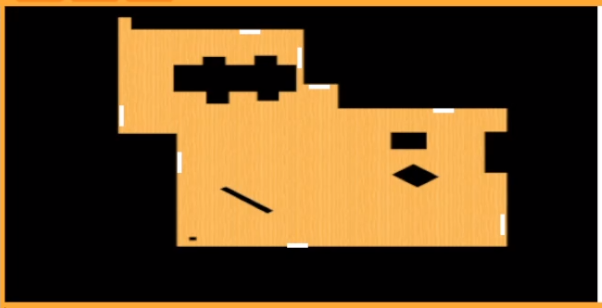
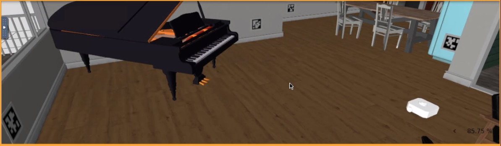
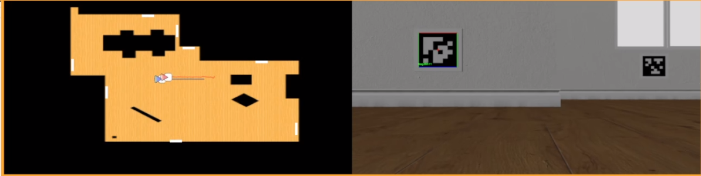
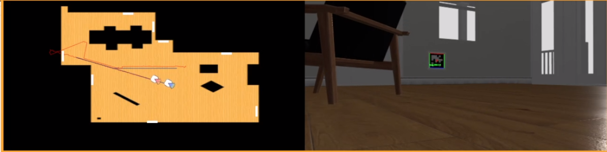
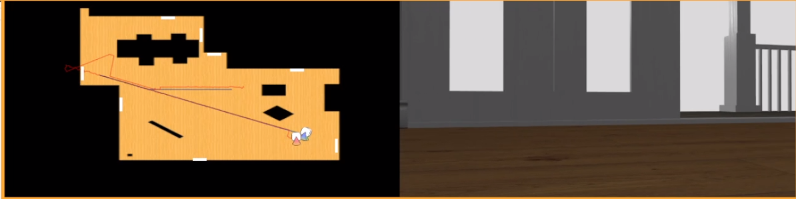

# P6 Marker Visual Loc

# Introducción

El objetivo de este ejercicio es estimar la posición y orientación (pose) de un robot en un espacio 2D mediante la detección y el análisis de marcadores visuales, concretamente AprilTags. Este proceso implica el uso de visión artificial y calculo de matrices de transformación para los respectivos sistemas.

El robot verde representa la posición real. El robot azul representa la posición según la odometría (con ruido). El robot rojo representa la posición estimada por el usuario.

Para realizar este ejercicio, se propone seguir el siguente esquema:

1) Programar un algoritmo de exploración: Para este ejercicio, empleo una navegación lineal durante la detección del tag y giro cuando deja de detectar un tag.

2) Programar el algoritmo autolocalización Perspective-n-Point: En este apartado se extrae la posición-orientación relativa del robot empleando cv2.solvePnP.

3) Programar incremento por odometría: Esto consiste en medir con odometría el incremento de posición-orientación desde la última vez que vio baliza, sumarlo a la posición-orientación del robot que estimada.


<div align="left">
<p style = 'text-align:center;'> </p>
</div>

# Experiencias y resultados

## Algoritmo autolocalización

**Cv2.solvePnP()** utiliza el denominado modelo de cámara estenopeica. La vista de una escena se obtiene proyectando un punto 3D de la escena en el plano de la imagen mediante una transformación de perspectiva que forma el píxel correspondiente. Se representan en coordenadas homogéneas, es decir, como vectores homogéneos 3D y 2D, respectivamente.

Para usar la función es necesario pasar los siguientes parametros:

- **_Object_points_**: Esta matriz contine las dimensiones en 3D del objeto con el que se va trabajar. Como en nuetro caso es un tag, serán las dimensiones de las cuatro esquinas en el siguiente orden:

    - point 0: [-squareLength / 2, squareLength / 2, 0]
    - point 1: [ squareLength / 2, squareLength / 2, 0]
    - point 2: [ squareLength / 2, -squareLength / 2, 0]
    - point 3: [-squareLength / 2, -squareLength / 2, 0]

- **_Image_points_**: Aquí hay que añadir las coordenadas en 2D de las esquinas del tag. Es importate que siguan el mismo orden que tiene _Object_points_. La matriz está en pixeles y PNP se encarga de dar la distancía al objetivo en función del tamaño.

- **_camera_matrix_** y **_dist_coeffs_**: Estos parametros contienen los parametros intrinsecos de la camara, con ellos PNP es capaz de reproducir el modelo pinhole. 

- **_cv2.SOLVEPNP_IPPE_SQUARE_**: Este parametro marca que tipo de metodo que empleara PNP para resolver la aproximación. En mi caso use este, porque los tag son cuadrados y este metodo es más preciso.

**Fórmula empleada**

```py

success, rvec, tvec = cv2.solvePnP( object_points, image_points, camera_matrix, dist_coeffs, flags=cv2.SOLVEPNP_IPPE_SQUARE)

```

<div align="center">
<p style = 'text-align:center;'></p>
</div>


### Matrices empleadas

#### Camera_to_tag
 
Una vez usado _Cv2.solvePnP()_ obtenemos dos matrices rvec, tvec, estas equivalen a la rotación y traslación del marco de referencia de la cámara al marco de referencia de la tag. Es necesario invertir **rvec** para conseguir Camera->tag. PNP devuelve por defecto Tag->Camera.

```py
rvec, _ = cv2.Rodrigues(rvec)
tvec = tvec.reshape(3, 1)

camera_to_tag = -rvec.T @ tvec
```

Como este sistema se encuentra en el marco de referencia del tag, pero con los ejes que PNP pone en las proyecciones, es necesario alinear los ejes con respecto al mundo.

```py
R_cam_to_tag = np.array([
    [ 0,  0, -1],
    [-1,  0,  0],
    [ 0, -1,  0]
], dtype=np.float32)

# camera->tag in wold axes
camera_to_tag = R_cam_to_tag @ camera_to_tag

```

#### camera_to_world

Esta matriz la obtenemos multiplicando  x, y, z, yaw del tag detectado en el mundo y camera_to_tag sacada enteriormente. La matriz pasa del marco de la camara en el mundo a al propio marco del mundo.

```py
# camera->world in wold axes
camera_to_world = t_tag_to_world + R_tag_to_world @ camera_to_tag
```
Con esta matriz, ya obtenemos una aproximación de la camara en el mundo, pero es necesario mover estas coordenadas al marco del robot en el mundo.


#### robot_to_world

La matriz final que corresponde a la correción de ejes del mundo a los ejes del robot y el traslado del marco de la camara en el mundo al robot en el mundo.

```Py
# robot->world in wold axes
robot_to_world = camera_to_world + R_rob_cam @ t_rob_cam
```

### Posición estimada

Una vez calculada la última matriz, extraemos directamente las coordenadas estimadas. Es importante aclarar que todo este proceso se ha realizado trabajando con matrices [3,1] y los calculos se realizan de la siguiente forma:

- Las rotaciones son multiplicaciones de matrices [3,3] por [3,1]
- Las traslaciones son sumas de matrices [3,1] + [3,1]

De esta forma sacamos los resultados instantaneamente sin necesidad de matrices grandes.

```py
x_r, y_r, z_r = robot_to_world.flatten()
```

<div align="center">
<p style = 'text-align:center;'></p>
</div>


### Obtener Yaw

Con el metodo comentado anteriormente, matrices [3,1], solo sacaremos la posición del robot. Pero para obtener la inclinación solo es necesario multiplicar todas las matrices de rotacion empleadas durante todo el proceso.

```py
R_ct_w = R_tag_to_world @ R_tag_cam_world @ R_rob_cam
```

<div align="center">
<p style = 'text-align:center;'></p>
</div>


## Programar incremento por odometría

Cuando no se detecta ninguna baliza, la estimación del robot no se puede calcular puesto que no hay referencia. Para poder seguir controlando la orientación y la posición se realiza la lectura de odometría odometría quedandose con el incremento de posición-orientación desde la última vez.

<div align="center">
<p style = 'text-align:center;'></p>
</div>


# Video del funcionamiento

https://urjc-my.sharepoint.com/:v:/g/personal/e_martint_2022_alumnos_urjc_es/IQBFk4exfvkzQLT5n4j6Mrn0AbEmxPggedVA7__VQhlYkVI?nav=eyJyZWZlcnJhbEluZm8iOnsicmVmZXJyYWxBcHAiOiJPbmVEcml2ZUZvckJ1c2luZXNzIiwicmVmZXJyYWxBcHBQbGF0Zm9ybSI6IldlYiIsInJlZmVycmFsTW9kZSI6InZpZXciLCJyZWZlcnJhbFZpZXciOiJNeUZpbGVzTGlua0NvcHkifX0&e=DsQ3hF